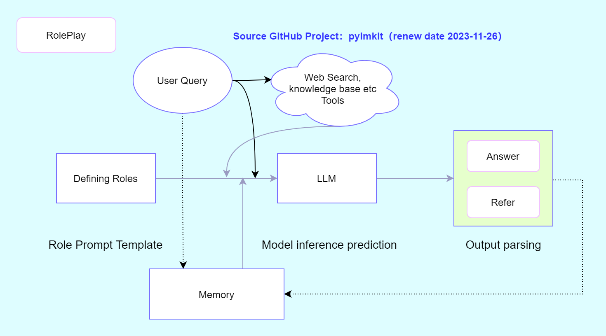
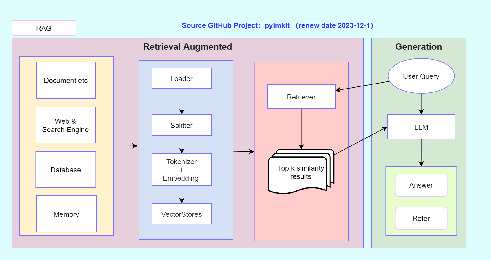
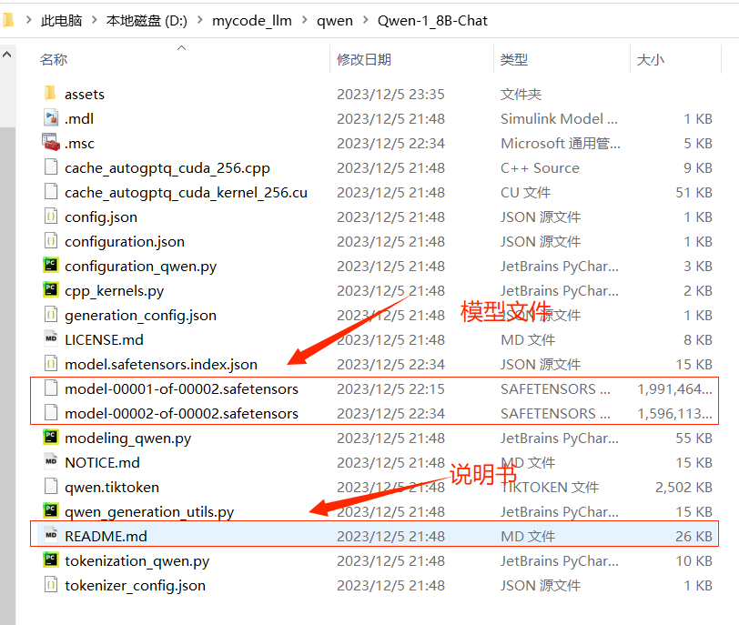

# PyLMKit


[README（English version）](https://github.com/52phm/pylmkit/blob/main/README_English.md)


**pylmkit** 是一个旨在构建或集成具有实际价值的大模型（LM）应用程序的项目，旨在帮助用户快速构建符合其业务需求的应用程序。


## 快速安装
```bash
pip install -U pylmkit
```

## 文档

- <a href="http://app.pylmkit.cn" target="_blank">PyLMKit应用（online application）</a>
- <a href="http://en.pylmkit.cn" target="_blank">English document</a>
- <a href="http://zh.pylmkit.cn" target="_blank">中文文档</a>


## 功能

- 1.角色扮演：通过设置角色模板并结合在线搜索、记忆和知识库功能，实现了典型的对话类的功能应用。RolePlay角色扮演是一种基础功能，也是重要的功能。现在在各大大模型企业的APP中可以看到很多关于`短视频文案、小红书文案、讲故事`等这些功能的底层逻辑是基于角色扮演中设置不同的角色模板实现的。
  
  - 案例教程

    - [PyLMKit RolePlay: Using Tutorials(English version)](https://github.com/52phm/pylmkit/blob/main/examples/01-RolePlay-APP.md)

    - [PyLMKit 角色扮演案例教程(简体中文版)](https://github.com/52phm/pylmkit/blob/main/examples/01-角色扮演应用案例.ipynb)




- 2.RAG（Retrieval-Augmented Generation，检索增强生成）是一种利用知识库检索的方法，提供与用户查询相关的内容，从而增强模型答案的准确性和特异性。RAG包括本地知识库、基于网络的知识库、记忆知识库和数据库知识库。

  - **PyLMKit设计了四种RAG功能**

    - 基于本地文档的知识库DocRAG
    - 基于网页的知识库WebRAG
    - 基于数据库的知识库DBRAG
    - 基于记忆的知识库MemoryRAG

  - 案例教程
  
    - [PyLMKit RAG: Using Tutorials(English version)](https://github.com/52phm/pylmkit/blob/main/examples/02-RAG-Retrieval-Augmented-Generation.md)
    - [PyLMKit基于知识库检索增强生成RAG案例教程(简体中文版)](https://github.com/52phm/pylmkit/blob/main/examples/02-基于知识库检索增强生成RAG案例.ipynb)




- 其他功能正在更新中……


## 快速开始

[PyLMKit QuickStart(English version)](https://github.com/52phm/pylmkit/blob/main/examples/00-QuickStart.md)

[PyLMKit 快速开始教程 (简体中文版)](https://github.com/52phm/pylmkit/blob/main/examples/00-快速开始.md)

## LLM模型使用

`PyLMKit`目前集成了`LLM`模型分为：

- `API`付费调用型
- 本地开源模型下载部署

**API 调用型**

（1）首先配置好 `API KEY`，便于调用`LLM`模型。

一个方便的方法是创建一个新的`.env`文件，并在其中配置所有的API密钥信息，从而方便地使用不同的模型。`.env`文件的格式如下：
```python
openai_api_key = ""  # OpenAI

QIANFAN_AK = ""  # 百度-千帆
QIANFAN_SK = ""

DASHSCOPE_API_KEY = ""  # 阿里-通义

spark_appid = ""  # 科大讯飞-星火
spark_apikey = ""
spark_apisecret = ""
spark_domain = "generalv3"  # generalv2

zhipu_apikey = ""  # 清华-智谱AI

baichuan_api_key = ""  # 百川
baichuan_secret_key = ""

hunyuan_app_id = ""  # 腾讯-混元
hunyuan_secret_id = ""
hunyuan_secret_key = ""
```

（2）`LLM`模型有两种调用方式：

- 普通模式：invoke(query) 
- 流式模式：stream(query)

其中，`query`表示用户输入内容，简单例子如下：

```python
from pylmkit.llms import ChatQianfan  # 百度-千帆
from pylmkit.llms import ChatSpark  # 讯飞-星火
from pylmkit.llms import ChatZhipu  # 清华-智谱
from pylmkit.llms import ChatHunyuan  # 腾讯-混元
from pylmkit.llms import ChatBaichuan  # 百川
from pylmkit.llms import ChatTongyi  # 阿里-通义
from pylmkit.llms import ChatOpenAI  # OpenAI
from dotenv import load_dotenv


# 加载 .env
load_dotenv()
# 加载模型
model = ChatQianfan()

# 普通模式
res = model.invoke(query="如何学习python？")
print(res)

# 流式模式
res = model.stream(query="如何学习python？")
for i in res:
    print(i)

```

**本地开源模型部署和调用**

预先安装 `modelscope` 依赖包
```bash
pip install modelscope
```

- （1）开源模型下载

本案例采用一个很小的模型作为例子，让大多数人都能成功运行这个Demo。这个Demo在CPU环境也能成功运行，并且内存占用小，模型名称为 `Qwen/Qwen-1_8B-Chat`，更多
模型名称，可以去魔搭社区去找相应的模型，链接：[魔搭社区-文本生成](https://www.modelscope.cn/models?page=1&tasks=text-generation&type=nlp)

```python
from pylmkit.llms import LocalLLMModel

LocalLLMModel(model_path='Qwen/Qwen-1_8B-Chat',  # 模型名称
              tokenizer_kwargs={"revision": 'master'},  
              model_kwargs={"revision": 'master'},
              language='zh',  # zh 表示使用国内环境下载，速度快
)
```

下载好的效果如下：


- （2）将下载模型及文件拷贝到自己想要的位置

一般采用上述下载方式，模型都会下载缓存到 `C` 盘，缓存的位置一般在：`C:\Users\你的用户名\.cache\modelscope\hub`，
将刚刚下载的`qwen/Qwen-1_8B-Chat`文件夹剪切保存到 `D:/mycode_llm/` （这里举个例子，可以自定义）路径下，主要避免文件太大占满 `C` 盘。

- （3）安装该开源模型的依赖库：`requirements.txt`

这一步骤很重要，一方面要保证你的`CUDA`环境配置正确、内存足够，即硬件资源得够（当然，CPU环境也可以跑一些模型）；另一方面则需要到开源模型的github或者根据其它教程，安装依赖包和推理加速等依赖文件。

一般在下载的模型文件夹里，会有一个`README.md`文件，这是一个关于模型基本信息和安装的说明书，不懂安装依赖库的同学可以详细参照着这个教程来安装，比如`Qwen/Qwen-1_8B-Chat`文件夹内容截图如下：



这个步骤做好了，下一步骤才能正确运行模型，不然可能会遇到大量BUG，那么这个时候就需要一个一个排查和解决。

- （4）加载本地模型并使用

```python
from pylmkit.llms import LocalLLMModel


model = LocalLLMModel(model_path='D:/mycode_llm/qwen/Qwen-1_8B-Chat',  # 前面保存的模型文件路径
                      tokenizer_kwargs={"revision": 'master'},
                      model_kwargs={"revision": 'master'},
                      language='zh'
                      )

# 普通模式
res = model.invoke(query="如何学习python？")
print(">>>invoke ", res)

# 流式模式
res = model.stream(query="如何学习python？")
for i in res:
    print(">>>stream ", i)


```

效果如下


## 开源协议

Apache License Version 2.0


